# Wallet Payment Backend

A production-style digital wallet backend built with **FastAPI**, featuring double-entry accounting, idempotent transaction processing, async background workers, and Redis-backed middleware.

> **Live demo:** [https://wallet-tv64.onrender.com](https://wallet-tv64.onrender.com)

## Features

- **User authentication** — registration, login, JWT bearer tokens (bcrypt + python-jose)
- **Wallet management** — create, retrieve, delete wallets (one wallet per user enforced)
- **Transactions** — deposit, withdraw, transfer with full validation
- **Double-entry ledger** — every transaction creates matching DEBIT/CREDIT `LedgerEntry` rows for immutable audit trail
- **Idempotency** — Redis-backed `X-Idempotency-Key` middleware prevents duplicate processing on all mutating endpoints
- **Email receipts** — async transactional emails sent via Dramatiq + Brevo (SendinBlue)
- **Transaction history** — paginated history with sender/receiver names
- **Auto-migrations** — Alembic for schema versioning; tables also auto-created on startup

## System Architecture



## Transaction Flow



## Tech Stack

| Layer | Technology |
|---|---|
| Framework | FastAPI (async) |
| ORM | SQLModel + SQLAlchemy 2.0 (async) |
| Database | SQLite (`aiosqlite`) / PostgreSQL-ready |
| Auth | JWT (python-jose) + bcrypt (passlib) |
| Queue | Dramatiq (Redis broker) |
| Cache / Locking | Redis (`redis.asyncio`) |
| Email | Brevo (SendinBlue) API |
| Migrations | Alembic |

## Project Structure

```
├── main.py                         # FastAPI app entry point, lifespan, middleware
├── config.py                       # Environment variable configuration
├── workers.py                      # Dramatiq async workers (email receipts)
├── alembic/                        # Database migrations
│   ├── env.py
│   └── versions/
├── core/
│   ├── security.py                 # Password hashing, JWT creation
│   └── limiter.py                  # Centralized rate limiter definitions (signup, auth,transactions)
|
├── db/
│   ├── models.py                   # SQLModel tables (User, Wallet, Transaction, LedgerEntry)
│   └── session.py                  # Async engine, session factory
├── dependencies/
│   └── auth.py                     # JWT bearer auth dependency
├── middleware/
│   └── idempotency.py              # Redis-backed idempotency middleware
├── routers/
│   ├── auth.py                     # POST /signup, POST /token
│   ├── users.py                    # GET /users/me, GET /users/{id}
│   ├── wallet.py                   # POST/GET/DELETE /wallet
│   └── transaction.py              # PATCH /deposit|withdraw|transfer, GET /history, GET /{id}/ledger
└── schemas/
    ├── user.py                     # UserCreate, UserResponse, Token
    ├── wallet.py                   # WalletCreate, WalletResponse
    └── transaction.py              # DepositWithdrawRequest, TransferRequest, LedgerEntryResponse
```

## Quick Start

### Prerequisites

- Python 3.11+
- Redis (for idempotency + Dramatiq broker)
- A Brevo (SendinBlue) API key for email receipts (optional — worker failures are non-blocking)

### Setup

```bash
# Clone and enter the project
cd wallet

# Create a virtual environment
python3 -m venv .venv
source .venv/bin/activate

# Install dependencies
pip install -r requirements.txt

# Copy and configure environment variables
cp .env.example .env
# Edit .env with your values (see Configuration)

# Run database migrations
alembic upgrade head

# Start the API server
uvicorn main:app --reload
```

> **Note:** If you don't have a `requirements.txt`, install manually:  
> `pip install fastapi uvicorn sqlmodel sqlalchemy aiosqlite alembic python-dotenv python-jose passlib bcrypt redis dramatiq brevo httpx`

### Running Workers

In a separate terminal, start the Dramatiq worker to process email receipts:

```bash
dramatiq workers
```

## Configuration

All configuration is loaded from environment variables (`.env` file):

| Variable | Description | Default |
|---|---|---|
| `SECRET_KEY` | JWT signing secret | (required) |
| `ALGORITHM` | JWT algorithm | `HS256` |
| `ACCESS_TOKEN_EXPIRE_MINUTES` | JWT token lifetime | `30` |
| `DATABASE_URL` | Database connection string | `sqlite+aiosqlite:///database.db` |
| `REDIS_URL` | Redis connection string | `redis://localhost:6379` |
| `BREVO_API_KEY` | Brevo transactional email API key | (optional) |
| `SENDER_MAIL` | From address for email receipts | (optional) |
| `SENDER_NAME` | From name for email receipts | (optional) |

## API Reference

### Authentication

| Method | Path | Auth | Description |
|---|---|---|---|
| POST | `/signup` | No | Register a new user |
| POST | `/token` | No | Login, receive JWT access token |

**POST /signup**

```json
{ "first_name": "Jane", "last_name": "Doe", "email": "jane@example.com", "password": "securepass123" }
```

**POST /token** (form-encoded)

| Field | Value |
|---|---|
| `username` | User's email |
| `password` | User's password |

Response: `{ "access_token": "...", "token_type": "bearer" }`

---

### Users

| Method | Path | Auth | Description |
|---|---|---|---|
| GET | `/users/me` | Yes | Get the current authenticated user |
| GET | `/users/{user_id}` | No | Get a user by ID |

---

### Wallets

| Method | Path | Auth | Description |
|---|---|---|---|
| POST | `/wallet` | Yes | Create a wallet (one per user) |
| GET | `/wallet` | Yes | Get the authenticated user's wallet |
| DELETE | `/wallet` | Yes | Delete the authenticated user's wallet |

**POST /wallet**

```json
{ "balance": 1000, "currency": "USD" }
```

---

### Transactions

All mutating transaction endpoints require the `X-Idempotency-Key` header (a UUID string) to ensure exactly-once processing.

| Method | Path | Auth | Idempotency | Description |
|---|---|---|---|---|
| PATCH | `/transaction/deposit` | Yes | Required | Add funds to wallet |
| PATCH | `/transaction/withdraw` | Yes | Required | Withdraw funds from wallet |
| PATCH | `/transaction/transfer` | Yes | Required | Transfer funds to another wallet |
| GET | `/transaction/history` | Yes | No | Paginated transaction list |
| GET | `/transaction/{id}/ledger` | Yes | No | Double-entry ledger rows for a transaction |

**PATCH /transaction/deposit**

```json
{ "amount": 500, "currency": "USD" }
```

**PATCH /transaction/withdraw**

```json
{ "amount": 200, "currency": "USD" }
```

**PATCH /transaction/transfer**

```json
{ "to_account_id": 2, "amount": 100, "currency": "USD" }
```

**GET /transaction/history** — query parameters:

| Param | Default | Max |
|---|---|---|
| `limit` | 10 | 100 |
| `offset` | 0 | — |

---

## Double-Entry Ledger

Every financial transaction atomically creates two immutable `LedgerEntry` rows:

| Transaction | Debit Entry | Credit Entry |
|---|---|---|
| **Deposit** | System (null wallet) | Receiver wallet |
| **Withdraw** | Sender wallet | System (null wallet) |
| **Transfer** | Sender wallet | Receiver wallet |

Each ledger entry records:
- The affected `wallet_id` (null = the system/external side)
- The `entry_type` (debit / credit)
- The `amount` and `currency`
- A `balance_snapshot` — the wallet's balance immediately after the entry

The unique constraint `(transaction_id, entry_type)` guarantees no duplicate legs per transaction.

## Idempotency

The `X-Idempotency-Key` header enables safe retries:

1. First request — processed normally, response cached in Redis for 24 hours
2. Duplicate request within 24h — cached response returned immediately (`X-Cache-Lookup: HIT`)
3. Concurrent duplicate — acquires a Redis lock; second request receives `409 Conflict` until the first completes

## Background Workers

Email receipts are dispatched asynchronously via **Dramatiq**:

```bash
# Start the worker (requires Redis running)
dramatiq workers
```

The `mail_reciept` actor generates HTML receipts for deposit, withdrawal, and transfer transactions and sends them via the Brevo API. Worker failures are independent of the API response — the transaction is committed before the task is enqueued.

## Validation Rules

- Wallet balance must never go negative (DB-level `CHECK` constraint)
- Currency codes must be exactly 3 uppercase characters
- Passwords must be at least 8 characters
- Withdrawals and transfers require sufficient balance
- Transaction currency must match the wallet's currency
- Cannot transfer to your own wallet
- One wallet per user is enforced

## Database Migrations

```bash
# Generate a new migration after model changes
alembic revision --autogenerate -m "description of change"

# Apply pending migrations
alembic upgrade head

# Roll back one step
alembic downgrade -1
```

Migrations are configured for async SQLite with batch mode enabled.

## License

This project is currently a work in progress and does not include a license file.
